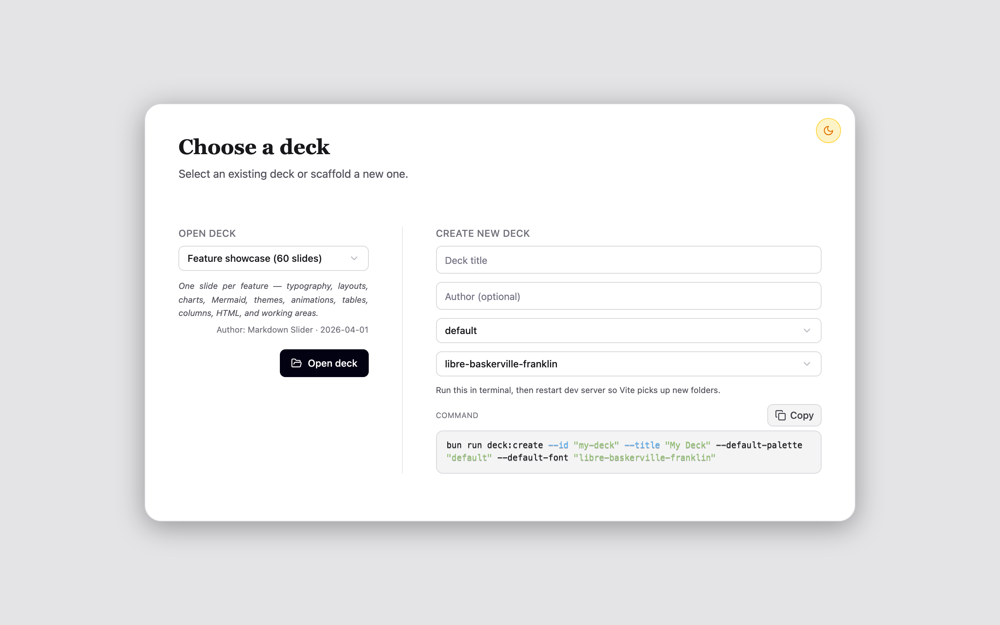
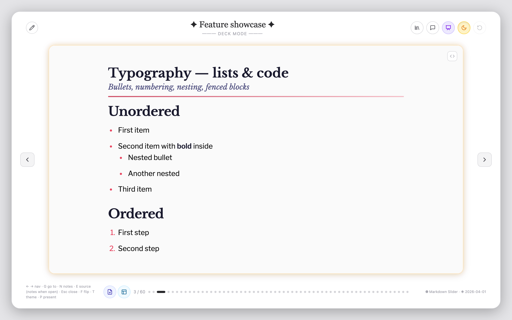
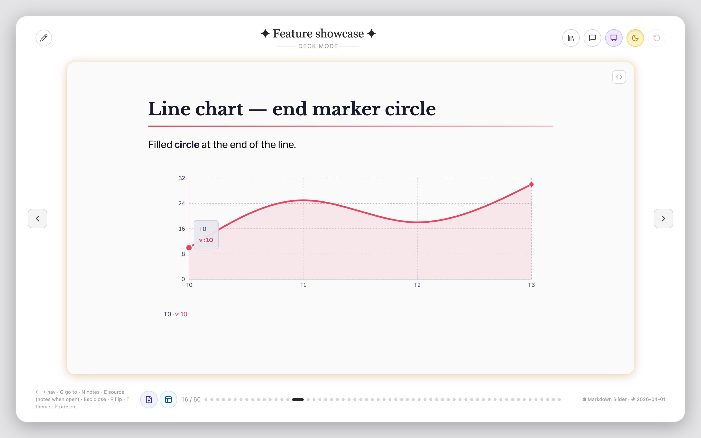

# Markdown Slider

A Vite + React presentation app for markdown and HTML slides with theme packs, charts (Recharts), Mermaid diagrams, multi-column layouts, and optional per-slide working areas.

## Screenshots

Deck selector (light mode):



[Sample deck](decks/sample-deck/) — slide 3:



Sample deck — slide 16:



## Requirements

Install [Bun](https://bun.sh), then from this directory:

```bash
bun install
```

## Scripts

| Command | Description |
|--------|-------------|
| `bun run dev` | Start the Vite dev server |
| `bun run build` | Production build to `dist/` |
| `bun run deck:create --id deck01 --title "Deck 01" [--subtitle "…"]` | Scaffold a new deck |
| `bun run deck:export --id deck01 --out ./deck01.zip` | Export one deck to zip |
| `bun run deck:import --zip ./deck01.zip` | Import deck zip into `decks/` |
| `bun run screenshots:readme` | Regenerate `docs/readme/*.png` (needs `bun run dev` and [Playwright](https://playwright.dev) Chromium: `bunx playwright install chromium`) |

Restart the dev server after adding new files under `decks/` or `themes/` so Vite's glob imports pick them up.

---

## Folder structure

```text
markdown-slider/
├── decks/
│   ├── sample-deck/           # Tracked sample deck
│   │   ├── metadata.md        # Deck metadata frontmatter
│   │   └── slide01/
│   │       ├── slide.md
│   │       ├── slide.html
│   │       ├── speaker.md       # Optional per-slide speaker notes (markdown)
│   │       └── working-area/
│   │           ├── slide.md
│   │           ├── slide.html
│   │           ├── style.css
│   │           └── script.js
│   └── <your-local-decks>/    # Usually gitignored
├── themes/
│   ├── palettes/              # Color tokens (`*.yaml`); `_*.yaml` ignored
│   └── fonts/                 # Typography tokens (`*.yaml`)
├── src/
└── scripts/deck-cli.mjs
```

### Deck and slide discovery

- App starts on a deck picker screen.
- A deck is discovered from `decks/<deckId>/` with at least one `slideNN/slide.md` or `slide.html`.
- Deck metadata comes from `decks/<deckId>/metadata.md`.
- Slide folders are naturally sorted (`slide01`, `slide02`, ..., `slide10`).
- If both `slide.md` and `slide.html` exist in one slide folder, `slide.md` wins.
- Optional **`speaker.md`** in each `slideNN/` folder holds markdown speaker notes. In the app, open them from the header (notes icon) or press **N**; they appear in a bottom sheet (**Esc** closes). Use **Preview** / **Edit** in the sheet to view or change markdown; with **`bun run dev`**, **Save** writes `speaker.md` to disk (same dev-only persistence as slide source). Restart the dev server if you add new `speaker.md` files so Vite’s glob picks them up.

### Deck metadata (`metadata.md`)

```yaml
---
title: Team Update
subtitle: DECK MODE
author: Jane Doe
date: 2026-03-31
defaultPalette: default
defaultFont: libre-baskerville-franklin
description: Weekly roadmap sync
tags:
  - weekly
  - roadmap
---
```

`subtitle` is the small line under the deck title in the app header (deck mode). `defaultPalette` and `defaultFont` set the slide look when a slide omits `palette` / `font` (and optional legacy `theme:`). You can still use **`defaultTheme`** alone as a shorthand for a named bundle; see [`themes/README.md`](themes/README.md).

While viewing a deck with **`bun run dev`**, use **Edit deck metadata** (pencil in the header) and click **Save** to write `decks/<id>/metadata.md` on disk. **Copy YAML** is still available if you need the snippet outside the dev server.

With the dev server running, **Save** in the slide or working-area source panel writes the current `slide.md` / `slide.html` (and working-area files) to the repo; **Save** in the speaker notes sheet (Edit mode) writes `speaker.md`. **Add Slide** / **Add Working Area** create folders and files under `decks/` (no production build / static preview).

### Working area

- If `decks/<deckId>/slideNN/working-area/slide.md` or `slide.html` exists, that slide has a working area.
- Use the header control or **F** to flip between main slide and working area.
- For HTML working areas, optional `style.css` and `script.js` are inlined at build time.

---

## Themes

Slide appearance merges a **palette** (`themes/palettes/*.yaml`) and a **font pack** (`themes/fonts/*.yaml`). Example pairings: **default** palette + **libre-baskerville-franklin**; **watermelon-sorbet** + **lora-manrope**; **rustic-charm** + **montserrat-nunito**; **monochrome-red** + **oswald-montserrat**; **cherry-blossom** + **lusitana-raleway**; **fiery-ocean** + **ovo-mulish**.

Mix and match in frontmatter:

```yaml
palette: monochrome-red
font: lora-manrope
```

Legacy **bundle** shorthand (same pairs as before):

```yaml
theme: monochrome-red
```

If `palette` / `font` are missing on a slide, deck defaults apply (see **Deck metadata**), then the **`default`** bundle.

### Slide layouts (`layout:` in frontmatter)

| `layout` | What you see |
|----------|----------------|
| `content` | *(default)* Header with `title` and optional `subtitle`; markdown body scrolls below. |
| `cover` | **Only** frontmatter `title` and `subtitle` (and optional `backgroundImage:` for full-bleed). Text after the closing `---` is **not rendered**—put all visible copy in YAML. |
| `infographic` | Strong header with `title` only (`subtitle` hidden); body for compact KPIs or one diagram. |
| `image` | Centered figure from a markdown image in the body; optional `caption`, `imageWidth`, `imageHeight` in frontmatter. |
| `quote` | Quote body (e.g. blockquote); `subtitle` works well as attribution. |

Examples: `decks/sample-deck/slide05` (content), `slide07` / `slide51` (cover), `slide06` (infographic), `slide08` (image), `slide59` (quote), `slide61` (corner watermark).

### Deck image URLs

For **`backgroundImage:`**, **`cornerImage:`**, **`slideLogo:`** / **`logoImage:`**, and markdown **``** images, paths resolve as follows:

- **`http://` or `https://`** — used as-is.
- **Leading `/`** — site root (e.g. files under `public/`).
- **No scheme and no leading `/`** — treated as **slide-relative**: `decks/<deckId>/<slideNN>/your-file.png`.

Supported extensions for bundled slide assets: `.png`, `.jpg`, `.jpeg`, `.gif`, `.webp`, `.svg`. At build time those files are included; with `bun run dev`, new files are also served via `/__deck/asset/…` until the dev server rescans (restart if Vite does not pick up a new file).

### Corner watermark (`cornerImage:` in frontmatter)

Optional decorative image anchored to a corner of the slide card (any markdown `layout:`). The image is masked with a diagonal fade so it reads as a semi-transparent watermark. The layer sits flush with the slide’s rounded border (slide padding is applied to the content stack instead so the watermark is not inset).

| Key | Purpose |
|-----|---------|
| `cornerImage` | Image URL or slide-relative filename (required to enable the feature). |
| `cornerPosition` | `top-left`, `top-right`, `bottom-left`, `bottom-right` (default `top-right`). Also accepts `topLeft`-style names. |
| `cornerScale` | Number (e.g. `1.5`, `2`, `0.5`) — multiplies the corner watermark region size (base ≈ `min(42%, 14rem)`), capped by the slide. Default `1`. |
| `cornerAppearance` | Comma-separated CSS filters: `grayscale`, `white` (light silhouette), `invert`. Example: `invert, grayscale`. Omit or `none` for no filter. YAML list form also works: `[invert, grayscale]`. Alias: `cornerFilter`. |
| `cornerOpacity` | 0–1 for overall layer opacity. Default `1`. |
| `cornerGradient` | `outward` (default), `soft`, or `strong` — radial mask centered on the slide corner (`cornerPosition`), fading toward the slide center. Use `linear` for the previous diagonal linear mask. |

### Slide logo (`slideLogo:` / `logoImage:` in frontmatter)

Optional **non-watermark** logo or brand mark: **no gradient mask**, positioned in a corner with **inset** from the slide card (`logoPadding`). The layer sits above the slide body content (below the editor chrome in the app). Use this when you want padding and distance from the edges; use **`cornerImage:`** when you want the faded corner treatment.

| Key | Purpose |
|-----|---------|
| `slideLogo` or `logoImage` | Image URL or slide-relative filename (required to enable the feature). |
| `logoPosition` | `top-left`, `top-right`, `bottom-left`, `bottom-right` (default `top-right`). Same naming style as `cornerPosition`. |
| `logoScale` | Number — multiplies the logo region size (base ≈ `min(32%, 11rem)`). Default `1`. |
| `logoPadding` | CSS length(s) inset from the chosen corner: one value for both axes, or two values as `vertical horizontal` (e.g. `1rem 2rem`). Default `1.25rem`. |
| `logoOpacity` | 0–1. Default `1`. |
| `logoAppearance` / `logoFilter` | Same as `cornerAppearance` / `cornerFilter` (e.g. `grayscale`, `invert`). |
| `logoAlt` | Optional accessible label for the image. |

---

## Import / Export

- Create a deck with one starter slide:

  ```bash
  bun run deck:create --id deck01 --title "Deck 01" --subtitle "Optional tagline" --author "You" --default-palette default --default-font libre-baskerville-franklin
  ```

- Export a deck:

  ```bash
  bun run deck:export --id deck01 --out ./deck01.zip
  ```

- Import a deck:

  ```bash
  bun run deck:import --zip ./deck01.zip
  ```

Deck id collisions are auto-resolved by suffixing (`-2`, `-3`, ...).

---

## UI overview

- **Deck picker**: choose a deck from the list and **Open deck**, or fill **Create new deck** and copy the generated `deck:create` command. Primary actions use the app design tokens (`src/styles/theme.css`); light/dark mode toggles both the chrome and the document `dark` class so colors stay consistent.
- **Navigation**: side arrows, footer dots, and keyboard shortcuts (see footer hint).
- **Theme toggle (T)**: sun/moon switches light vs dark mode for the shell.
- **Flip (F)**: switches to working area when available.
- **Add Slide** / **Add Working Area**: footer buttons; with the dev server they create slide folders / `working-area/` on disk (disabled without dev API).
- **Per-slide source (E)**: code button edits raw `slide.md` / `slide.html`; use **Save** in the source panel to persist (dev server).
- **Presentation (P)**: fullscreen slide view; **Esc** exits.
- **Go to slide (G)**: jump by slide number.
- **Edit deck metadata**: pencil in the header opens the dialog; **Save** writes `metadata.md` when using `bun run dev`, otherwise overrides stay in the browser until you use **Copy YAML**.

---

## See also

- [`themes/README.md`](themes/README.md) for theme authoring
- `decks/sample-deck/` for the tracked example deck
