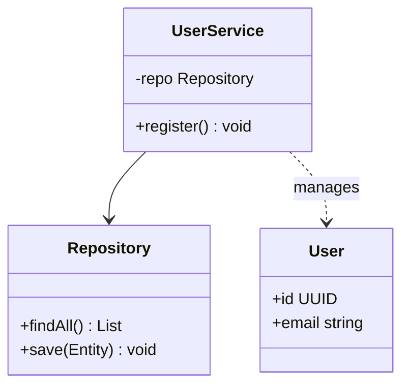

```mermaid
classDiagram
  class Repository {
    +findAll() List
    +save(Entity) void
  }
  class UserService {
    -repo Repository
    +register() void
  }
  class User {
    +id UUID
    +email string
  }
  UserService --> Repository
  UserService ..> User : manages
```
