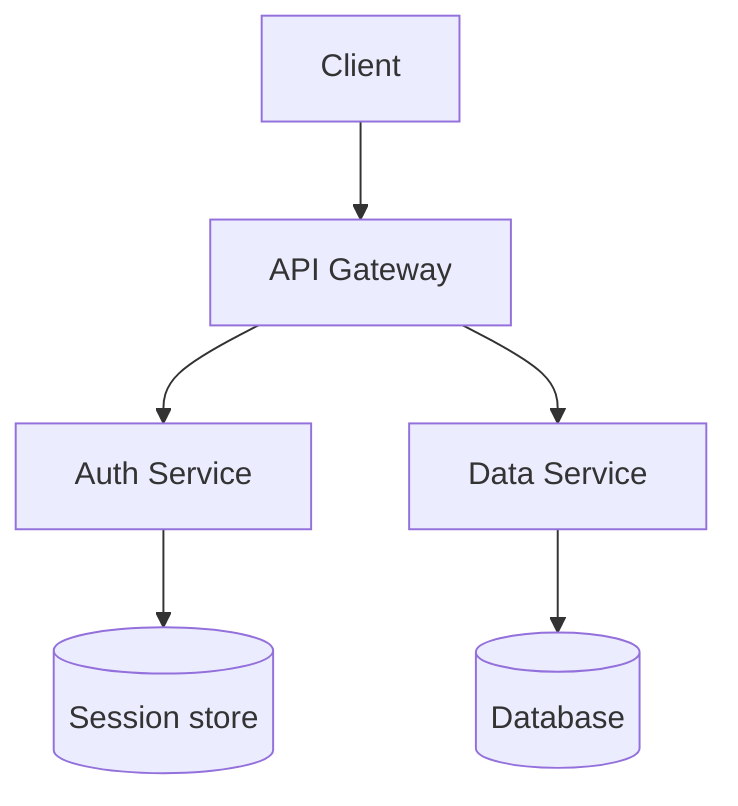

Diagram colors follow the active slide theme (`--slide-accent`, text, code surface, borders).

```mermaid
flowchart TD
    A[Client] --> B[API Gateway]
    B --> C[Auth Service]
    B --> D[Data Service]
    C --> E[(Session store)]
    D --> F[(Database)]
```

Try toggling **light / dark** in the app — the diagram re-renders with updated theme tokens.
